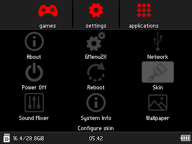

# rg350_skins
A matching skin for each RG350 handheld console color.

 

# Installation
Download and unzip.\
Copy the MatBlack, MatClear and MatGrey folder to /media/home/.gmenu2x/skins

# Credits 
Based on FlatDark-Rg350-skin from ctrlBIRDdelete and on ScanlinesRed from Gmenu2x

Apps icons from www.iconsdb.com and www.icons8.com

Emulators icons from www.iconarchive.com/show/antiseptic-videogame-icons-by-starvingartist.html

Png online editor www.photopea.com

OPK file extension online viewer www.filext.com/file-extension/OPK
