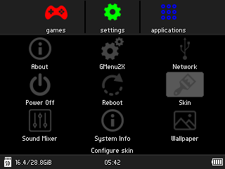

# rg350_skins
A matching skin for each handheld console RG350 color.

 

# Installation
Download and unzip.\
Copy the MatBlack, MatClear and MatGrey folder to /media/home/.gmenu2x/skins

# Credits 
Based on the skins FlatDark-Rg350-skin from ctrlBIRDdelete and on the ScanlinesRed from Gmenu2x
