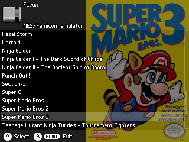

# RG350 Skins
A matching skin for each color of the RG350 handheld console.

 
 

 

# Installation
Download and unzip.\
Copy the skin folder to /media/home/.gmenu2x/skins\
Select the skin and reboot the console.

# Previews Arts
In each folder containing roms create a folder with the name : previews  
Put box arts images or screenshot images in the folder (must be .png 240px max height) with the name of the rom.

 
 

# Credits 
Based on FlatDark-Rg350-skin from ctrlBIRDdelete, gmenu2x-skin-flat from peeweek and on ScanlinesRed from Gmenu2x

Apps icons from www.iconsdb.com and www.icons8.com

Emulators icons from www.iconarchive.com/show/antiseptic-videogame-icons-by-starvingartist.html

Png online editor www.photopea.com

OPK file extension online viewer www.filext.com/file-extension/OPK

Box arts images for the roms www.thecoverproject.net
